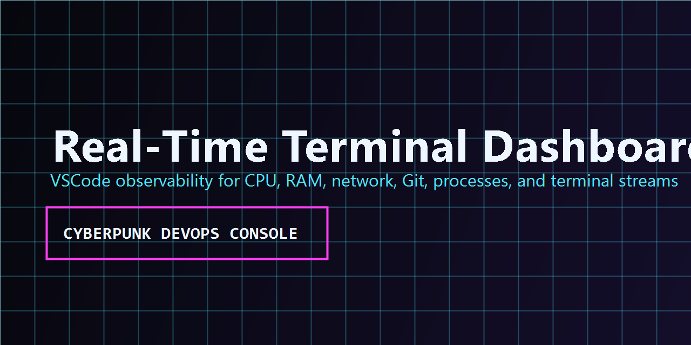

# Real-Time Terminal Dashboard

A premium VSCode developer dashboard for realtime system, process, Git, network, and terminal telemetry.



## Features

- Realtime CPU and RAM pulse chart with a low-load canvas renderer.
- Live memory, network, Git, and process telemetry from a local FastAPI backend.
- WebSocket-powered updates with conservative polling defaults for stable laptops.
- Cyberpunk terminal dashboard UI using HTMX, vanilla JavaScript, and FastAPI templates.
- VSCode status bar health indicator: Offline, Starting, Online, Installing, and Error.
- Backend dependency installer command for local Python environment setup.
- Command Palette lifecycle controls for opening, starting, stopping, and preparing the dashboard.

## Commands

```text
Real-Time Terminal Dashboard: Open Dashboard
Real-Time Terminal Dashboard: Start Backend
Real-Time Terminal Dashboard: Stop Backend
Real-Time Terminal Dashboard: Install Backend Dependencies
```

## Requirements

- VSCode 1.90 or newer.
- Python available on PATH, or configured through `realtimeTerminalDashboard.pythonPath`.
- The extension can create and use its local backend `.venv` when dependencies are installed.

## Extension Settings

- `realtimeTerminalDashboard.backendPort`: local FastAPI backend port. Default: `8765`.
- `realtimeTerminalDashboard.pythonPath`: Python executable used to create/run the backend environment. Default: `python`.

## Local Development

From the repository root:

```powershell
cd extension
npm.cmd install
npm.cmd run compile
```

Press `F5` in VSCode and run `Real-Time Terminal Dashboard: Open Dashboard` in the Extension Development Host.

## Build VSIX

```powershell
cd extension
npm.cmd run package
```

The package script syncs the Python backend into `extension/backend`, compiles TypeScript, and creates `real-time-terminal-dashboard.vsix`.

## Publish

Before publishing, create a Visual Studio Marketplace publisher named `DzCodeProgrammer`, then login with a Personal Access Token:

```powershell
cd extension
npx vsce login DzCodeProgrammer
npm.cmd run publish
```

## Notes

The backend binds to `127.0.0.1` only. It is designed as a local developer tool, not a remote monitoring server.